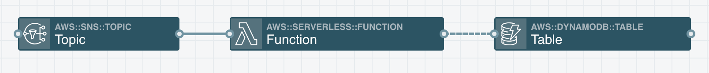

### Creating A Buggy App
Wait, why are we creating a buggy app? Well, so we can fix it! This repo has a [CloudFormation](https://aws.amazon.com/cloudformation/) template we can deploy. The template describes the infrastructure of an app, and the CloudFormation service takes that template and provisions the app into your AWS account.

The architecture of this app looks like:



To start, we're going to run a few commands that will use CloudFormation to provision the app:

```
aws cloudformation create-stack --stack-name sss-sns-to-db --template-url https://stackery-demo-assets.s3.amazonaws.com/template.yaml --capabilities CAPABILITY_AUTO_EXPAND CAPABILITY_IAM CAPABILITY_NAMED_IAM
```

This will start provisioning resources into your AWS account. It should take around a minute to deploy. You can monitor the status as it deploys by running the following command until the output says `CREATE_COMPLETE`:

```
aws cloudformation describe-stacks --stack-name sss-sns-to-db --output text --query 'Stacks[0].StackStatus'
```

#### If the stack fails to create...
If the stack fails to create successfully, you can issue the following command to see a log of the events. There will be a message in one of the events explaining why the stack failed to create.

```
aws cloudformation describe-stack-events --stack-name sss-sns-to-db --output text --query 'StackEvents[*].[ResourceType,LogicalResourceId,ResourceStatus,ResourceStatusReason]'
```

Then, run the following command to delete the broken stack so you can retry creating the stack:

```
aws cloudformation delete-stack --stack-name sss-sns-to-db
```

## [Continue To Module 2!](./Module-2.md)